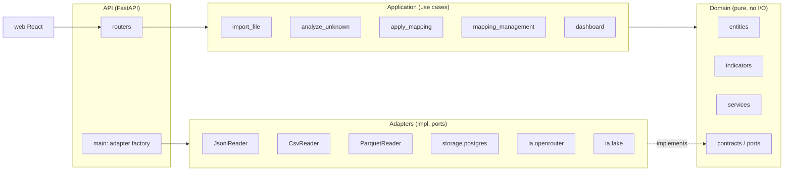

# Architecture

## Component diagram

## Dependency rule

`domain ← application ← api`. Adapters **implement** the domain's ports; they
do not sit beneath it. The API's `main.py` is the **only** place that picks
concrete adapters and wires them to use cases.

- `domain` depends on nothing but the standard library.
- `application` depends only on `domain` (ports + entities + services).
- `adapters` implement `domain` ports; they may import SQLAlchemy, httpx, pandas.
- `api` imports `application`, `adapters` and `config`; nothing else.
- `cli` is a thin wrapper that starts the API server; it does not contain business logic.

## Decisions (see `decisions.md`)

1. **Idempotence** by `file_hash` + natural key `(source_id, external_session_id)`.
2. **Deterministic import engine**: the AI proposes a mapping; the engine applies it. No code produced by the model is ever executed.
3. **Indicators computed in Python/SQL**, never by the AI.
4. **Explicit missing values** (`NULL` + flags), never a silent zero.
5. **Ports defined in the domain**; adapters are replaceable; the domain is testable without infrastructure.
6. **OpenRouter as the single AI provider**, with the model chosen via `.env`. `FakeAgent` runs the full pipeline in CI without a network or API key.
