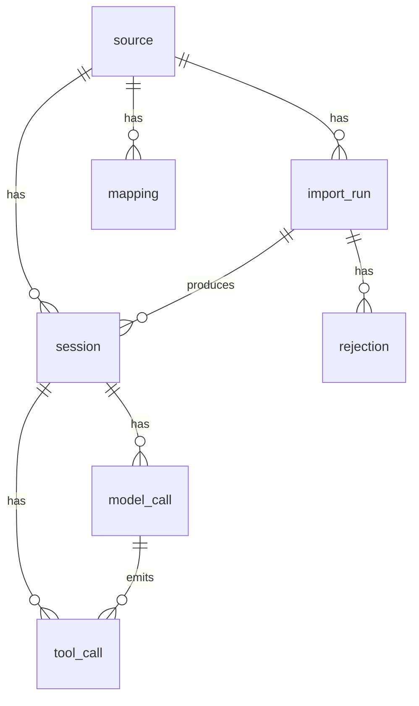

# Data model

## Relational schema (3NF)

| Table | One row = | Natural key |
|---|---|---|
| `source` | one dataset provenance | `id` |
| `import_run` | one file upload | `file_hash` (unique) |
| `session` | one coding-agent session | `(source_id, external_session_id)` |
| `model_call` | one LLM round within a session | `id` |
| `tool_call` | one tool invocation within a session | `id` |
| `mapping` | one versioned field-to-field mapping | `(source_id, version)` — enforced at application level |
| `rejection` | one line rejected at import time | `id` |

## 3NF justification

- Every table has a single atomic key.
- Non-key attributes depend only on the key of their table.
- No transitive dependency: e.g. `session.agent` depends on the session, not on
  the import that brought it in (`import_run_id` is kept for traceability only).
- `model_call.raw_payload` and `session.metadata` are JSONB escapes for fields
  whose shape varies across sources; they are **never** used to compute
  indicators (those are projected into typed columns at normalization time).

## Missing values

A metric that does not exist for a source is stored as `NULL` (the column is
nullable). Indicators expose this in their definition
(`docs/indicators.md`) — a missing value is never turned into zero.

## Provenance

Every row carries `source_id` and `import_run_id` so the origin of any
observation can be traced back to the file that produced it.
